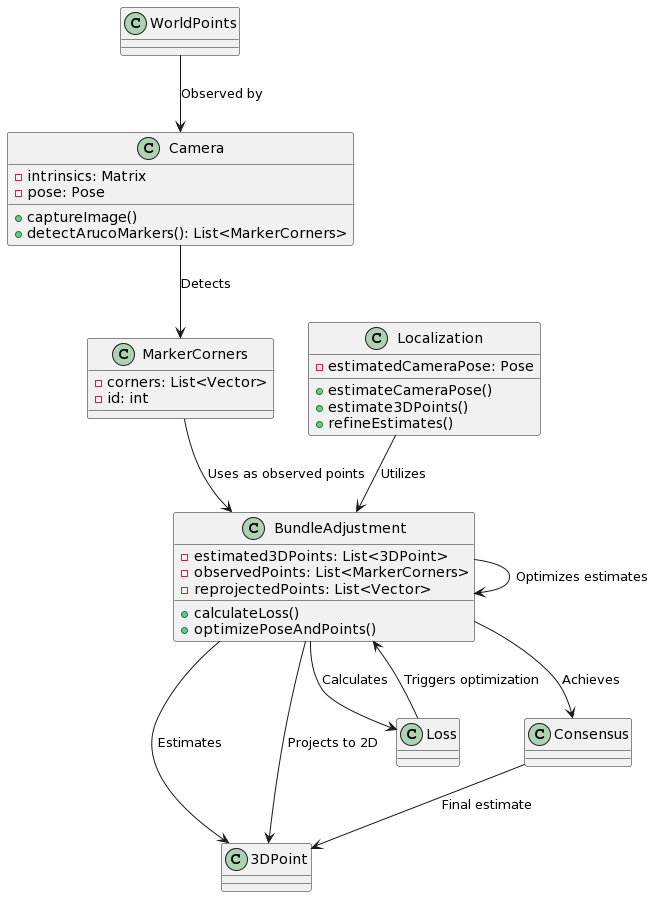

Vision
----
----

This repository contains the source code for the vision library being used for 3D localization.

Extendable up to arbitrary no. of cameras.

Computational complexity evolves as O(n^2*k). Where n is the no. of points, k the optimisation steps.

Currently we're testing with 4 aruco markers, for points.
However as long as any feature is detected by multiple cameras, we just need to change detection.

# Flow chart for data flow

